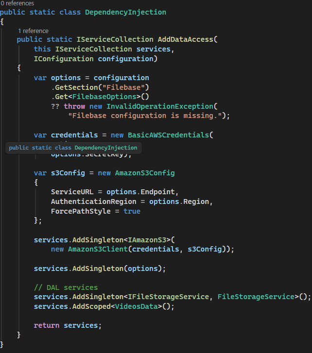
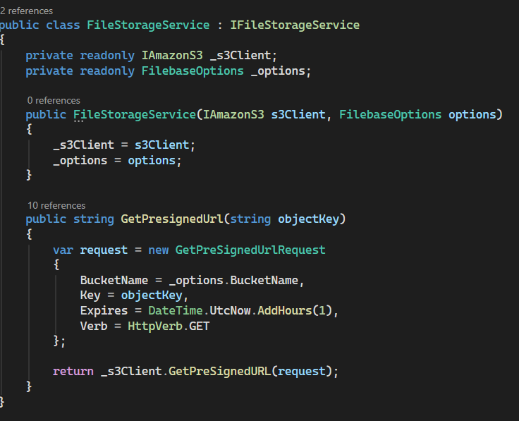
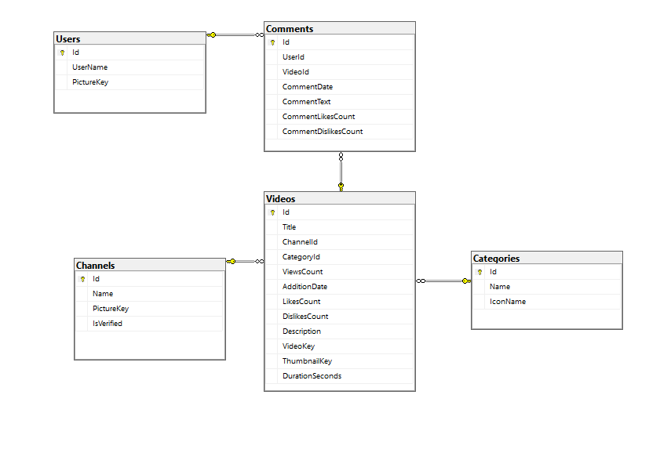
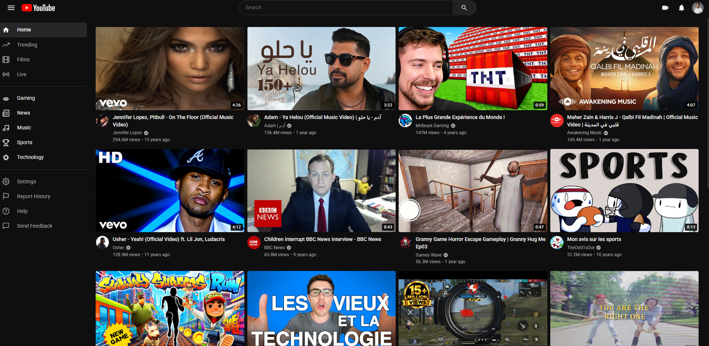
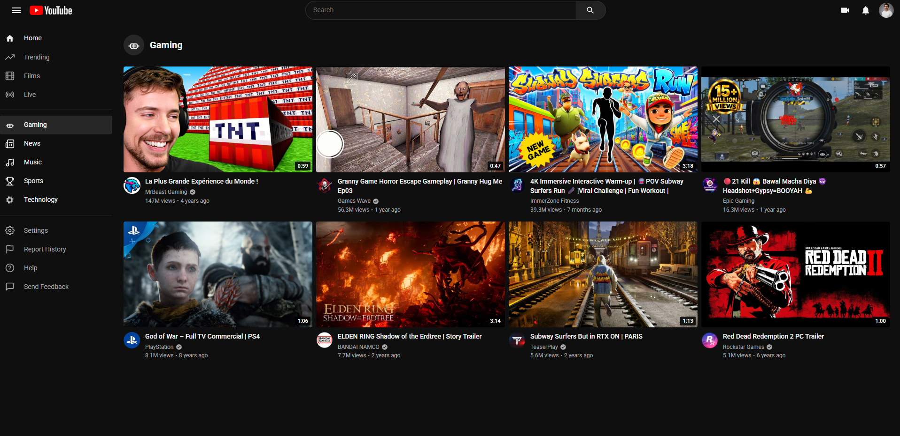
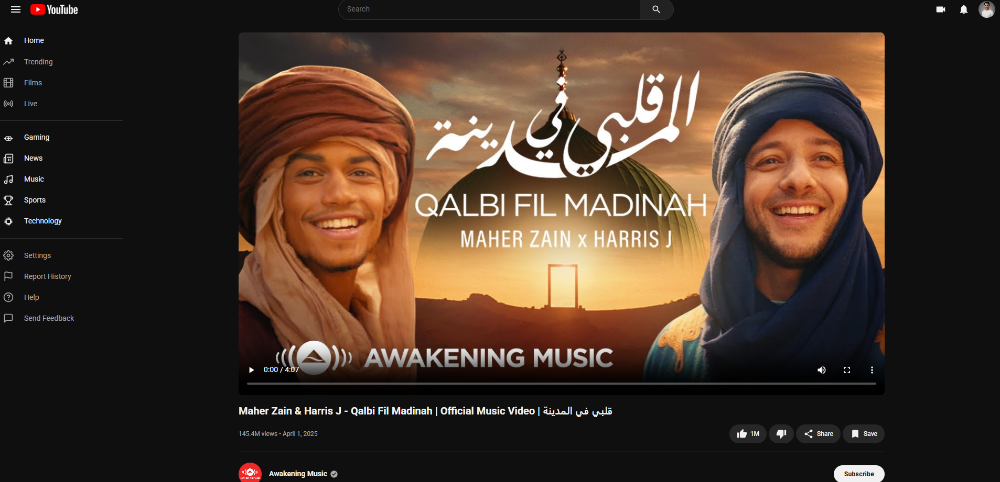
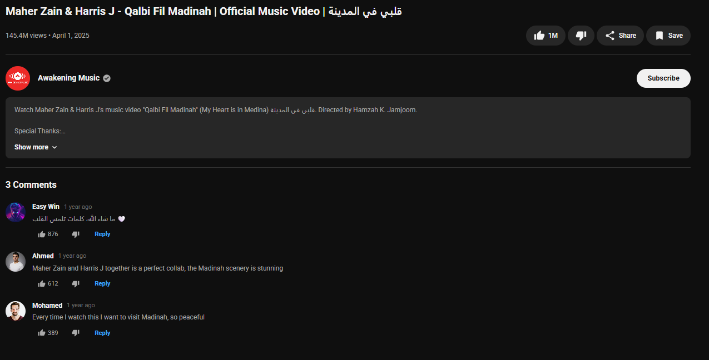
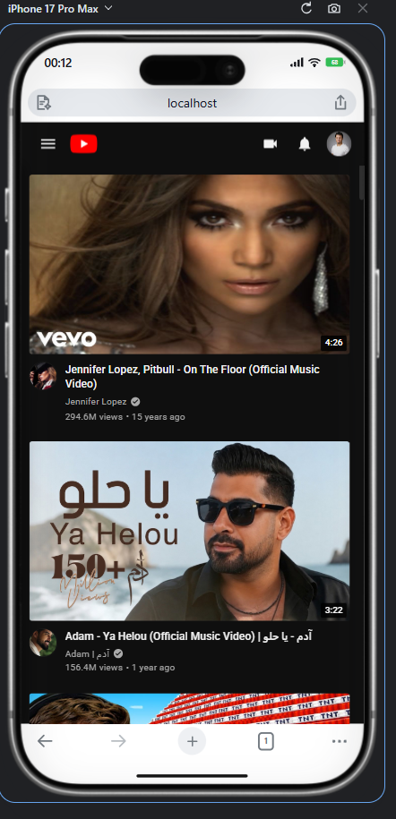

<div align="center">

# 📺 VideoTube — YouTube-Clone with AWS S3 Object Storage


A **YouTube-inspired video streaming clone** built with **ASP.NET Core** and powered by **AWS S3-compatible object storage via Filebase** — storing videos, thumbnails, and user profile pictures in the cloud, not on disk.

**👨‍💻 Author:** Marnissi Ahmed Mustapha &nbsp;|&nbsp; **📅 Last Updated:** May 2026

[](https://github.com/AhmedMustaphaMarnissi)

</div>

---

## ⚡ TL;DR

A YouTube-clone web app that clones the core UI and feature set — home feed, category filtering, video detail pages, likes, comments — built on top of **ASP.NET Core** with **SQL Server** for relational data. The distinguishing focus: **all binary assets (videos, thumbnails, profile pictures) are stored in Filebase**, an S3-compatible object storage service, using the **AWS SDK for .NET** (`AWSSDK.S3`). Presigned URLs are generated on demand so no file ever lives on the server disk.

👉 Not about building the flashiest UI — it's about wiring up **cloud object storage** the right way.

---

## 💡 Key Highlights

- AWS S3-compatible object storage via **Filebase** for all media files
- `IAmazonS3` injected as a singleton with `BasicAWSCredentials` + custom `AmazonS3Config`
- `GetPresignedUrl` generates time-limited (1-hour) signed URLs for secure file access
- `FileStorageService` implements `IFileStorageService` — clean abstraction over the S3 client
- `ForcePathStyle = true` to work with Filebase's S3-compatible endpoint
- 5-table ERD: Users, Channels, Videos, Categories, Comments
- `VideoKey` and `ThumbnailKey` stored in the database; actual files live in the bucket
- Category-based video filtering (Gaming, News, Music, Sports, Technology)
- Video detail page with likes, dislikes, view count, channel info
- Comments section with comment likes/dislikes per video
- Fully responsive UI on desktop and mobile (iPhone 17 Pro Max tested)

---

## 📋 Table of Contents

- [Overview](#overview)
- [The S3 / Filebase Integration](#-the-s3--filebase-integration)
  - [Dependency Injection Setup](#dependency-injection-setup)
  - [FileStorageService — Presigned URLs](#filestorageservice--presigned-urls)
- [Database Design](#-database-design)
- [Pages & Screenshots](#pages--screenshots)
  - [Home Feed](#-home-feed)
  - [Category Filtering](#-category-filtering)
  - [Video Details](#-video-details)
  - [Comments & Description](#-comments--description)
  - [Responsive Design](#-responsive-design)
- [Tech Stack](#tech-stack)
- [Getting Started](#getting-started)
- [What I Learned](#-what-i-learned)

---

## Overview

**VideoTube** is a YouTube-inspired web application that replicates the core user experience: browsing a home video feed, filtering by category, clicking into a video detail page, reading and posting comments, and interacting with like/dislike counts.

The real learning objective of this project is **cloud object storage**. Rather than saving uploaded video files and thumbnails to a local server path, VideoTube integrates with **Filebase** — an S3-compatible decentralized storage provider — using the standard **AWS SDK for .NET**. The database stores only a `VideoKey` and `ThumbnailKey` string per video; the actual binary files live in the bucket and are served via presigned S3 URLs that expire after 1 hour.

---

## ☁️ The S3 / Filebase Integration

### Dependency Injection Setup

The S3 client is configured and registered as a singleton during application startup. The `Filebase` section in `appsettings.json` provides the `AccessKey`, `SecretKey`, `Endpoint`, `Region`, and `BucketName`. A validation guard throws `InvalidOperationException` if the section is missing.

```csharp
var options = configuration
    .GetSection("Filebase")
    .Get<FilebaseOptions>()
    ?? throw new InvalidOperationException(
        "Filebase configuration is missing.");

var credentials = new BasicAWSCredentials(
    options.AccessKey,
    options.SecretKey);

var s3Config = new AmazonS3Config
{
    ServiceURL = options.Endpoint,
    AuthenticationRegion = options.Region,
    ForcePathStyle = true
};

services.AddSingleton<IAmazonS3>(
    new AmazonS3Client(credentials, s3Config));

services.AddSingleton(options);

// DAL services
services.AddSingleton<IFileStorageService, FileStorageService>();
services.AddScoped<VideosData>();
```



> `ForcePathStyle = true` is required when working with S3-compatible providers like Filebase that do not use AWS virtual-hosted-style bucket URLs.

---

### FileStorageService — Presigned URLs

`FileStorageService` wraps `IAmazonS3` and exposes a single `GetPresignedUrl(string objectKey)` method. Given any stored key (for a video file, thumbnail, or profile picture), it returns a presigned GET URL valid for **1 hour** — so the client can stream or display the file without any permanent public access on the bucket.

```csharp
public class FileStorageService : IFileStorageService
{
    private readonly IAmazonS3 _s3Client;
    private readonly FilebaseOptions _options;

    public FileStorageService(IAmazonS3 s3Client, FilebaseOptions options)
    {
        _s3Client = s3Client;
        _options = options;
    }

    public string GetPresignedUrl(string objectKey)
    {
        var request = new GetPreSignedUrlRequest
        {
            BucketName = _options.BucketName,
            Key = objectKey,
            Expires = DateTime.UtcNow.AddHours(1),
            Verb = HttpVerb.GET
        };

        return _s3Client.GetPreSignedURL(request);
    }
}
```



> The `VideoKey` and `ThumbnailKey` values stored in the `Videos` table are passed directly to `GetPresignedUrl` to resolve the full URL when rendering the UI.

---

## 🗄️ Database Design

The database uses **5 tables** connected through foreign keys, keeping a clear separation between user identity, channel ownership, video metadata, categorization, and user comments.

| Table | Key Fields |
|---|---|
| **Users** | Id, UserName, PictureKey |
| **Channels** | Id, Name, PictureKey, IsVerified |
| **Videos** | Id, Title, ChannelId, CategoryId, ViewsCount, LikesCount, DislikesCount, **VideoKey**, **ThumbnailKey**, DurationSeconds, AdditionDate, Description |
| **Categories** | Id, Name, IconName |
| **Comments** | Id, UserId, VideoId, CommentText, CommentDate, CommentLikesCount, CommentDislikesCount |

`VideoKey` and `ThumbnailKey` in the `Videos` table are the S3 object keys. The actual files are stored in Filebase; the database never holds binary data.



---

## Pages & Screenshots

### 🏠 Home Feed

The main landing page mirrors YouTube's dark-mode grid layout. Videos are displayed as thumbnail cards with title, channel name, verified badge, view count, and upload date. The left sidebar lists navigation categories: Home, Trending, Films, Live, Gaming, News, Music, Sports, Technology — plus Settings, Report History, Help, and Send Feedback.



---

### 🗂️ Category Filtering

Clicking a category from the sidebar filters the video grid to show only videos in that category. The Gaming category page, for example, shows MrBeast Gaming, Granny Game Horror Gameplay (Games Wave), Subway Surfers Run, PUBG Mobile, God of War, Elden Ring Shadow of the Erdtree (BANDAI NAMCO), and Red Dead Redemption 2 (Rockstar Games).



---

### 🎬 Video Details

Clicking a video opens the detail page with the video player embedded at full width. Displayed metadata includes the video title, view count, upload date, and the action bar with Like (1M), Dislike, Share, and Save buttons. The channel name with verified badge and a Subscribe button appear below the player.

**Sample video:** Maher Zain & Harris J — Qalbi Fil Madinah (Official Music Video) — 145.4M views • April 1, 2025 — Awakening Music ✅



---

### 💬 Comments & Description

Below the video details panel, the description section expands to show the video description, and the comments section lists all user comments with their like and reply counts.

**Sample comments on Qalbi Fil Madinah:**
- Easy Win (1 year ago) — "ما شاء الله، كلمات تلمس القلب ♥" — 876 likes
- Ahmed (1 year ago) — "Maher Zain and Harris J together is a perfect collab, the Madinah scenery is stunning" — 612 likes
- Mohamed (1 year ago) — "Every time I watch this I want to visit Madinah, so peaceful" — 389 likes



---

### 📱 Responsive Design

The full layout adapts to mobile screen sizes. On an **iPhone 17 Pro Max** viewport, the video feed collapses to a single-column vertical scroll — each card showing the thumbnail, title, channel name, verified badge, view count, and timestamp stacked cleanly. The sidebar collapses to a hamburger menu icon at the top left.



---

## Tech Stack

| Layer | Technology |
|---|---|
| Backend Framework | ASP.NET Core |
| Language | C# |
| Object Storage | Filebase (S3-Compatible) via **AWSSDK.S3** |
| Storage Abstraction | `IFileStorageService` / `FileStorageService` |
| Presigned URLs | `GetPreSignedUrlRequest` — 1-hour expiry |
| Database | SQL Server |
| Data Access | ADO.NET / custom `VideosData` class |
| Fonts & Icons | Font Awesome / Google Fonts |
| Responsiveness | CSS Media Queries |

---

## Getting Started

### Prerequisites

- .NET SDK (ASP.NET Core compatible version)
- SQL Server (local or remote)
- A [Filebase](https://filebase.com) account with a bucket created
- Visual Studio or VS Code

### Setup

1. **Clone the repository:**
   ```bash
   git clone https://github.com/ahmedmustaphamarnissi/video-tube.git
   ```

2. **Navigate to the project folder:**
   ```bash
   cd video-tube
   ```

3. **Configure Filebase credentials** in `appsettings.json`:
   ```json
   {
     "Filebase": {
       "AccessKey": "YOUR_FILEBASE_ACCESS_KEY",
       "SecretKey": "YOUR_FILEBASE_SECRET_KEY",
       "Endpoint": "https://s3.filebase.com",
       "Region": "us-east-1",
       "BucketName": "your-bucket-name"
     }
   }
   ```

4. **Apply the database schema** using the provided SQL scripts or run migrations.

5. **Run the application:**
   ```bash
   dotnet run
   ```

6. **Open your browser** at `https://localhost:{port}` — no build step required.

---

## 🧠 What I Learned

- Integrating **AWS SDK for .NET** (`AWSSDK.S3`) with an S3-compatible third-party provider (Filebase)
- Configuring `AmazonS3Config` with `ForcePathStyle = true` for non-AWS S3 endpoints
- Generating **presigned GET URLs** with time-limited expiry for secure media delivery
- Designing a clean service abstraction (`IFileStorageService`) over the S3 client for testability
- Storing only **object keys** in the database rather than full file paths or binary blobs
- Injecting `IAmazonS3` as a singleton with custom credentials via dependency injection
- Building a YouTube-style UI with category filtering, video detail pages, and a comment system
- Designing a relational schema (`Users → Channels → Videos → Categories + Comments`) that maps cleanly to the UI

---

<div align="center">

Built with ❤️ in Bizerte, Tunisia 🇹🇳

[](https://github.com/AhmedMustaphaMarnissi)

</div>